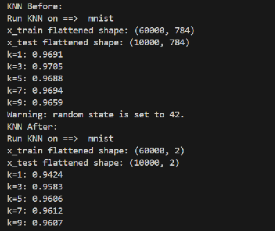
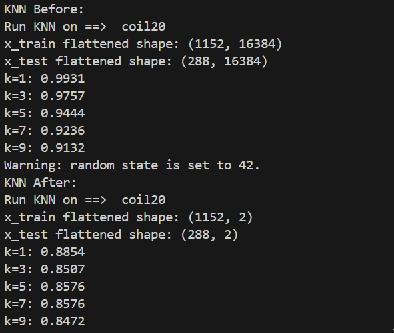
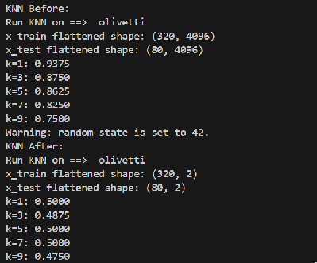

# PaCMAP
This project is done to experiment with the PaCMAP DR technique on different datasets 


## Instructions
The experiment's main program is `run.py`
The runner can take 5 arguments as follows:
```
python run.py <dataset> <DR_technique> <Eval_metrics> <Plot flag> <dimensions>
```
`<dataset>`: The available options are: coil20 - coil20-npy - mnist - olivetti - 20newsgroups (Required)
`<DR_technique>`: The available options are: PaCMAP - PCA (default PaCMAP)
`<Eval_metrics>`: The available options are: knn - trustworthiness - mrre - continuity - all - none (default all)
`<Plot>`: type `plot` to turn the flag on. Anything else to keep it off (default False)
`<dimensions>`: Select the number of dimensions you would like the DR technique to reduce to (default 2)
All arguments are not enforced. But if you run the runner with no arguments you will be prompted to select a dataset from the options

## Example runs 
python -u run.py coil20 pacmap all plot
python -u run.py coil20-npy pacmap none plot 3
python -u run.py mnist pacmap knn no 2
python -u run.py olivetti


## Experiment Results
### Run DR on training set only 


